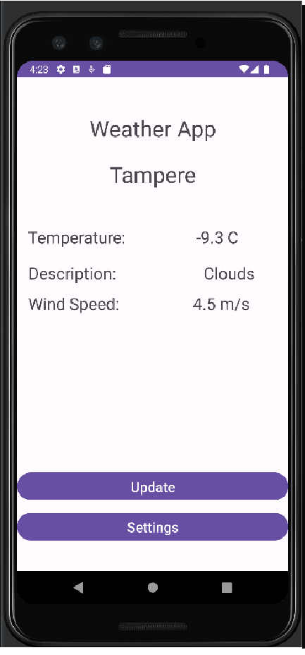
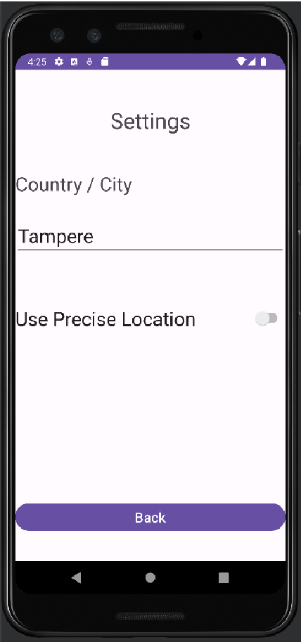

# Project Weather App

## Description

A simple Android weather app built with Android Studio and powered by Volley. This app allows users to check the weather for a specific location or use precise GPS coordinates for real-time weather updates.

## Features

- View current weather conditions, temperature, wind speed, and description.
- Choose a default location or enable precise location for accurate weather data.
- Access settings to customize the default location and enable/disable precise location updates.

## Usage

1. Upon launching the app, the default location is set to Tampere.
2. Enable precise location for real-time updates or set a custom default location in the settings.
3. View the current weather conditions by tapping the "Update Weather" button.

## Development

- The app is developed in Java using Android Studio.
- Volley library is used for handling network requests.
- Location services are integrated for precise weather updates.

## Screenshots

- MainActivity

- SettingsActivity

